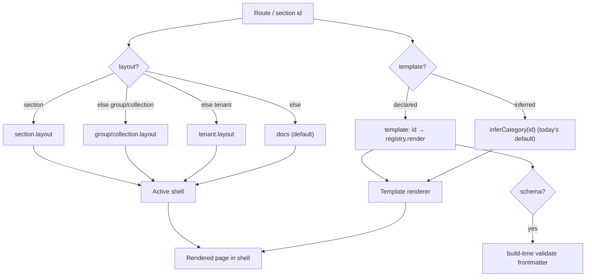

# ADR-016: Section-Scoped Layouts and Template Schemas

Status: Accepted (implemented 2026-06-29)
Date: 2026-06-28
Related: #79 (examples consolidation — the trigger), #90 (implementation), #91 (form-embed seam shipped alongside), ADR-007 (unified tenant deployment), ADR-010 (nested content directories)

## Implementation note (2026-06-29)

All five phases shipped and were browser-verified:

1. `src/lib/layout.js` — pure `resolveLayout` + `buildSectionLayoutMap` (17 tests).
2. The build emits `SECTION_LAYOUTS` / `TENANT_LAYOUT` / `layoutForSection()` in
   each tenant's `manifest.js`; only sections differing from the tenant default
   are listed.
3. The runtime sets `body[data-layout]` per route on navigation (no FOUC);
   `applyBlogLayout` generalized to scaffold the blog shell for mixed sites
   (tenant docs + a `layout: "blog"` collection) without forcing the global
   default.
4. `src/lib/templates.js` — template registry `{ id, schema? }` with `post` /
   `guide` reference schemas and a dependency-free validator; the build hard-fails
   on invalid frontmatter only when a section explicitly declares `template`
   (16 tests).
5. `examples/showcase` — one deploy mixing a docs group and a blog collection,
   with page-effects, on-this-page TOC, code-copy, living scroll, and forms;
   featured in the recipe gallery (closes #79).

## Context

Today a Pagenary site has **one** layout for the **whole tenant**:

- `config.layout` is `"docs"` (default) or `"blog"`. `applyBlogLayout()` sets
  `body[data-layout="blog"]` **once at build** (`scripts/build-tenants.js:1643`),
  and the CSS shell + parts of the runtime key off that static body attribute.
- A site is therefore *entirely* docs (header + sidebar + content + on-this-page
  TOC) **or** *entirely* blog (card index + reading-first post pages). You cannot
  have a "Guides" section and a "Blog" section in the same nav/deploy.

Two systems already point the way to a finer grain:

1. **Section templates** — `src/sections/section-templates.js` renders each section
   as `<section class="section doc" data-template="welcome|guide|reference|tutorial|…">`,
   chosen per section via `inferCategory()` (`src/lib/categories.js`). So a
   *per-section* render-template concept already exists — it is just informal
   (no declared schema, inferred from the id).
2. **Collections** — `config.collections[]` + `collections-generator.js` produce
   `index.json`/`feed.xml`; `applyBlogLayout()` wires a synthetic blog-index
   section from one chosen collection. The runtime already shapes *some* things
   per-section, not per-tenant: blog post-nav (#55) and the collection hero are
   **presence/metadata-guarded** (`src/app.js:434, 776`), not `data-layout`-guarded.

The gap is that the **shell/layout dimension** is still tenant-global, and the
**template dimension** is informal and schemaless. The operator wants (a) a single
site that mixes docs and blog sections, and (b) sections that can opt into
different **templates driven by different schemas**.

## Decision

Introduce two orthogonal, **section-scoped** dimensions, both backward-compatible
with today's tenant-level `layout`:

### 1. Layout (shell) becomes resolvable per nav group / collection / section

A `layout` may be declared at the **group**, **collection**, or **section** level
in addition to the tenant level. The active shell for a route is resolved by
precedence (most specific wins):

```
section.layout  ??  collection.layout  ??  group.layout  ??  tenant.layout  ??  "docs"
```

`layout` stays a small closed set of **shells**: `docs` (sidebar + content +
on-this-page TOC), `blog` (reading-first index + post pages), and room for future
shells (e.g. `landing`, `api`). The shell decides the chrome around the content.

### 2. Templates become a first-class registry with optional schemas

Promote the informal `section-templates.js` categories into a **template registry**.
A template is `{ id, render(section, ctx), schema? }`:

- `render` produces the section markup (today's `renderSectionTemplate`).
- `schema` is an optional JSON Schema for that template's **frontmatter/config**
  (e.g. a `post` template requires `date`; an `api-reference` template requires
  `endpoints[]`). When present, the build **validates** each section's frontmatter
  against it and fails the build with a precise error, the same way `check:seo`
  and `lint:content` already gate.

A section/collection declares its template by `template: "<id>"`; absent that, the
current `inferCategory()` behavior is the default (no regression). Templates and
layouts are **independent**: a `post` template can render inside the `blog` shell;
a `guide` template renders inside the `docs` shell; a future `changelog` template
could render in either.

### Resolution model



The shell dimension is *where the chrome comes from*; the template dimension is
*how the content body renders + what frontmatter it requires*.

## Options considered

| Option | Summary | Verdict |
|--------|---------|---------|
| **(a) Section-scoped layouts + template registry** (this ADR) | Move the shell decision down to group/collection/section; formalize templates with schemas | **Chosen** — it is the real product capability (#79 shows the demand) and it generalizes cleanly |
| (b) Docs tenant that *links* a blog sub-area | Keep tenant-level `layout: docs`; render blog posts inside the docs shell | Rejected for the product — fine as an interim *showcase* (the cheap path noted on #79) but it doesn't give a true blog section and doesn't generalize to other templates/schemas |
| (c) Status quo (one layout per tenant) | Do nothing; ship a separate blog deploy | Rejected — it is the duplication #79 is trying to remove and blocks mixed sites |

## Consequences

**Positive**
- One site can mix docs + blog (+ future shells) under one nav and one deploy —
  directly unblocks the #79 consolidation and is a capability tenants will want.
- Templates gain schemas: malformed frontmatter fails the build with a clear
  message instead of rendering wrong, consistent with the existing lint/SEO gates.
- The two dimensions are orthogonal and additive; nothing forces a tenant to adopt
  them.

**Negative / risks**
- The runtime must switch the **active shell per route** (set `body[data-layout]`
  on navigation) rather than once at load. Manageable — the router already does
  per-section shaping (post-nav, collection hero); this extends the same idea. The
  CSS shell must tolerate the attribute changing between routes without layout
  thrash (test for FOUC / scroll-position jumps on shell switches).
- Resolution precedence is new surface to document and test (group vs collection
  vs section vs tenant). Keep the precedence list short and covered by unit tests.
- Per-template schemas add a validation step; keep schemas optional so adoption is
  incremental.

**Backward compatibility**
- `config.layout` continues to work unchanged as the **tenant-level default** (the
  lowest-precedence entry). Sites that declare no group/section `layout` and no
  `template` behave exactly as today. `applyBlogLayout` becomes the
  tenant-default case of the general resolver.

## Phased plan (scope units — no time estimates per `no-time-estimates`)

1. **Resolver + data model (foundation).** Add optional `layout` to the
   group/collection/section schema in `manifest.js` + the tenant registry; write a
   pure `resolveLayout(section, group, collection, tenant)` with the precedence
   above and unit tests. No behavior change yet (tenant default only). *Verify:*
   resolver tests green; existing builds byte-identical.
2. **Build emits per-route layout.** Have `build-tenants.js` emit the resolved
   shell per section (a `sectionId → shell` map) instead of only the global
   `body[data-layout]`. Keep the global attribute as the initial/default.
   *Verify:* a fixture tenant with a docs group + a blog group builds; the map is
   correct; tenant-only sites unchanged.
3. **Runtime shell switching.** Router sets the active shell on navigation from the
   emitted map; CSS shell tolerates the switch (no FOUC, scroll preserved). Reuse
   the existing presence-guarded post-nav/hero. *Verify:* in-browser — navigate
   docs↔blog sections in one site, shells switch cleanly, prev/next + TOC behave
   per shell.
4. **Template registry + schemas.** Refactor `section-templates.js` into a
   registry `{ id, render, schema? }`; add a build-time frontmatter validator that
   runs when a section declares `template` with a schema; ship 1–2 reference
   schemas (`post`, `guide`). `inferCategory` stays the default. *Verify:* invalid
   frontmatter fails the build with a precise error; valid builds pass; existing
   sections (no declared template) unchanged.
5. **Consolidated showcase + docs (closes #79 step 3).** Build one showcase tenant
   that mixes a docs group and a blog collection in one deploy; reduce the
   theme/`nav-*` example sprawl; update `docs/TENANT-CONFIG.md` + examples README.
   *Verify:* one deploy demonstrates docs + blog + page-effects/TOC; example tenant
   count drops; no broken links.

Phases 1–2 are non-breaking and can land independently. Phase 3 is the
behavior-visible milestone (mixed sites work). Phases 4–5 layer schemas and the
showcase on top.

## References

- `scripts/build-tenants.js:1554,1643` — `LAYOUTS` set + `applyBlogLayout` (current tenant-level layout)
- `src/sections/section-templates.js`, `src/lib/categories.js` — current per-section template/category system
- `src/lib/collections-generator.js`, `config.collections[]` — collections
- `src/app.js:434,776` — runtime presence-guarded blog post-nav + collection hero (existing per-section shaping)
- #79 — examples consolidation (the consumer of this capability)
- `docs/BLOG-LAYOUT.md`, `docs/TENANT-CONFIG.md` — surfaces to update in phase 5
