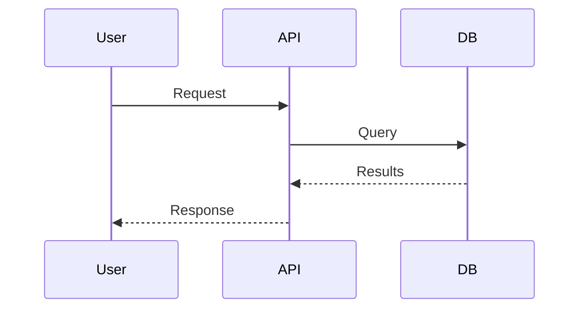

# Detailed Walkthrough

This walkthrough keeps the manual setup path: create content, add branding,
write a manifest, register a tenant, build, and preview. If you only want the
fastest default-theme start, use [Quickstart](quickstart.md) first.

## Prerequisites

- Node.js >= 16 (20+ recommended)

## Step 1: Install Pagenary

Use the published package. No clone is required:

```bash
npm install --save-dev @pagenary/publisher
npx pagenary --help
```

Building Pagenary from source instead? Clone the repo and work from the
workspace when you want to modify the generator:

```bash
git clone https://github.com/jmagly/pagenary.git
cd pagenary
npm run bootstrap
npm run publisher:build
npm run publisher:serve
```

## What You Get

Pagenary includes these features out of the box:

- **Command palette** - Press `Ctrl+K` or `Cmd+K` for ranked full-text search,
  navigation, and export.
- **SEO-first output** - Metadata-driven titles, crawlable `/pages/` snapshots,
  sitemap, robots, `llms.txt`, JSON-LD, and Open Graph metadata.
- **Static hosting** - The same bundle serves at a domain root or under a
  subpath on any static host, CDN, or the bundled Caddy setup.
- **Mermaid diagrams** - Embed flowcharts, sequence diagrams, and more using
  Mermaid syntax.
- **Safe external links** - External links open in new tabs with security
  headers.

## Step 2: Create Your Tenant Directory

Create a directory for your documentation:

```bash
mkdir my-docs
cd my-docs
mkdir content
```

## Step 3: Add Branding Configuration

Create `config.json`:

```json
{
  "title": "My Product Documentation",
  "description": "Complete guide to using My Product",
  "brandMark": "MY",
  "brandSub": "PRODUCT",
  "tagline": "Documentation that works",
  "copyright": "My Company",
  "accentColor": "#3B82F6",
  "surfaceColor": "#F8FAFC"
}
```

For the fastest start, you can omit the color fields and keep the default theme.

## Step 4: Create Your First Content

Create `content/welcome.md`:

```markdown
# Welcome to My Product

This is your documentation home page.

## Getting Started

Here's what you need to know to get started with My Product.

### Installation

\`\`\`bash
npm install my-product
\`\`\`

### Quick Example

\`\`\`javascript
import { MyProduct } from 'my-product';

const app = new MyProduct();
app.start();
\`\`\`

## Features

- **Fast** - Built for speed
- **Simple** - Easy to use
- **Powerful** - Full-featured

## Architecture

\`\`\`mermaid
graph TD
    A[User] --> B[Frontend]
    B --> C[API]
    C --> D[Database]
\`\`\`
```

Create `content/installation.md`:

```markdown
# Installation Guide

## Requirements

- Node.js 18 or higher
- npm or yarn

## Install via npm

\`\`\`bash
npm install my-product
\`\`\`

## Install via yarn

\`\`\`bash
yarn add my-product
\`\`\`

## Verify Installation

\`\`\`bash
npx my-product --version
\`\`\`
```

## Step 5: Create Navigation Manifest

Create `manifest.json`:

```json
[
  {
    "id": "welcome",
    "title": "Welcome",
    "summary": "Introduction to My Product",
    "file": "welcome.md"
  },
  {
    "id": "installation",
    "title": "Installation",
    "summary": "How to install My Product",
    "file": "installation.md"
  }
]
```

## Step 6: Register Your Tenant

Create or edit `tenants.json` at your project root:

```json
{
  "tenants": [
    {
      "id": "my-docs",
      "source": { "type": "local", "path": "./my-docs" },
      "strictLinks": true
    }
  ]
}
```

Building from source? Edit `apps/publisher/tenants.json` in the cloned repo
instead.

## Step 7: Build and Preview

```bash
npx pagenary build my-docs
npx pagenary serve
```

Open:

```text
http://localhost:5173/my-docs/
```

You should see your documentation with your branding applied.

From source, the equivalents are:

```bash
npm run build:tenants my-docs
npm run serve
```

## Step 8: Set Up a Local Domain

This step is optional. Use it when you want a more realistic local preview.

Edit `/etc/hosts` on Linux or macOS, or
`C:\Windows\System32\drivers\etc\hosts` on Windows:

```text
127.0.0.1 my-docs.local
```

Start the Caddy server:

```bash
npm run caddy:up
```

Visit:

```text
http://my-docs.local
```

## Next Steps

### Add More Content

Create additional `.md`, `.html`, or `.js` files in `content/`:

```text
content/
├── welcome.md
├── installation.md
├── guides/
│   ├── _manifest.json
│   ├── getting-started.md
│   └── advanced.md
└── api/
    ├── _manifest.json
    └── reference.md
```

### Organize with Section Manifests

Create `content/guides/_manifest.json`:

```json
{
  "title": "Guides",
  "sections": [
    { "id": "getting-started", "title": "Getting Started", "file": "getting-started.md" },
    { "id": "advanced", "title": "Advanced Usage", "file": "advanced.md" }
  ]
}
```

### Add Rich Content

Tables:

```html
<table class="spec-table">
  <thead>
    <tr><th>Feature</th><th>Status</th></tr>
  </thead>
  <tbody>
    <tr><td>Search</td><td>Ready</td></tr>
    <tr><td>Export</td><td>Ready</td></tr>
  </tbody>
</table>
```

Diagrams:



### Customize Theme

Adjust colors in `config.json` when you are ready to move beyond the default
theme:

| Color | Purpose | Example |
|-------|---------|---------|
| `accentColor` | Links, buttons, highlights | `#3B82F6` |
| `surfaceColor` | Page background | `#F8FAFC` |
