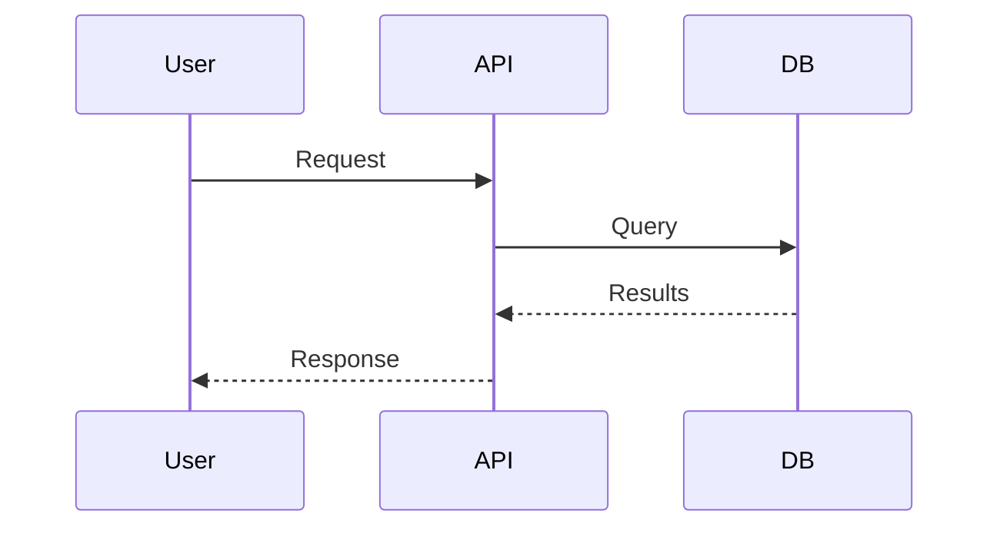

# Quick Start Guide

Create your first Pagenary documentation site in 10 minutes.

## Prerequisites

- Node.js 18+
- Git (for version control)

## Step 1: Set Up the Publisher

```bash
# Clone the repository
git clone https://github.com/jmagly/dbbuilder.git pagenary
cd pagenary

# Install dependencies
npm run bootstrap

# Verify installation
cd apps/publisher
npm run build
npm run serve
# Visit http://localhost:5173 to see the default docs
```

## Key Features

Pagenary includes several powerful features out of the box:

- **Command Palette** - Press `Ctrl+K` (or `Cmd+K` on Mac) to quickly navigate, search, and export
- **Mermaid Diagrams** - Embed flowcharts, sequence diagrams, and more using Mermaid syntax
- **Smart External Links** - External links automatically open in new tabs with security headers

## Step 2: Create Your Tenant Directory

Create a new directory for your documentation (can be anywhere on your system):

```bash
mkdir ~/my-docs
cd ~/my-docs
```

Create the basic structure:

```bash
mkdir content
```

## Step 3: Add Branding Configuration

Create `config.json`:

```json
{
  "title": "My Product Documentation",
  "description": "Complete guide to using My Product",
  "brandMark": "MY",
  "brandSub": "PRODUCT",
  "tagline": "Documentation that works",
  "copyright": "My Company",
  "accentColor": "#3B82F6",
  "surfaceColor": "#F8FAFC"
}
```

## Step 4: Create Your First Content

Create `content/welcome.md`:

```markdown
# Welcome to My Product

This is your documentation home page.

## Getting Started

Here's what you need to know to get started with My Product.

### Installation

\`\`\`bash
npm install my-product
\`\`\`

### Quick Example

\`\`\`javascript
import { MyProduct } from 'my-product';

const app = new MyProduct();
app.start();
\`\`\`

## Features

- **Fast** - Built for speed
- **Simple** - Easy to use
- **Powerful** - Full-featured

## Architecture

\`\`\`mermaid
graph TD
    A[User] --> B[Frontend]
    B --> C[API]
    C --> D[Database]
\`\`\`
```

Create `content/installation.md`:

```markdown
# Installation Guide

## Requirements

- Node.js 18 or higher
- npm or yarn

## Install via npm

\`\`\`bash
npm install my-product
\`\`\`

## Install via yarn

\`\`\`bash
yarn add my-product
\`\`\`

## Verify Installation

\`\`\`bash
npx my-product --version
\`\`\`
```

## Step 5: Create Navigation Manifest

Create `manifest.json`:

```json
[
  {
    "id": "welcome",
    "title": "Welcome",
    "summary": "Introduction to My Product",
    "file": "welcome.md"
  },
  {
    "id": "installation",
    "title": "Installation",
    "summary": "How to install My Product",
    "file": "installation.md"
  }
]
```

## Step 6: Register Your Tenant

Go back to the publisher directory and edit `tenants.json`:

```bash
cd /path/to/pagenary/apps/publisher
```

Add your tenant to `tenants.json`:

```json
{
  "my-docs": {
    "source": "/home/youruser/my-docs",
    "domain": "my-docs.local"
  }
}
```

## Step 7: Build and Preview

```bash
# Build your tenant
npm run build:tenants my-docs

# Start the server
npm run serve

# Visit http://localhost:5173/my-docs/
```

You should see your documentation with your branding applied.

## Step 8: Set Up Local Domain (Optional)

For a more realistic preview with custom domains:

1. Edit `/etc/hosts` (Linux/Mac) or `C:\Windows\System32\drivers\etc\hosts` (Windows):
```
127.0.0.1 my-docs.local
```

2. Start the Caddy server:
```bash
npm run caddy:up
```

3. Visit http://my-docs.local

## Next Steps

### Add More Content

Create additional `.md`, `.html`, or `.js` files in `content/`:

```
content/
├── welcome.md
├── installation.md
├── guides/
│   ├── _manifest.json
│   ├── getting-started.md
│   └── advanced.md
└── api/
    ├── _manifest.json
    └── reference.md
```

### Organize with Section Manifests

Create `content/guides/_manifest.json`:

```json
{
  "title": "Guides",
  "sections": [
    { "id": "getting-started", "title": "Getting Started", "file": "getting-started.md" },
    { "id": "advanced", "title": "Advanced Usage", "file": "advanced.md" }
  ]
}
```

### Add Rich Content

**Tables:**
```html
<table class="spec-table">
  <thead>
    <tr><th>Feature</th><th>Status</th></tr>
  </thead>
  <tbody>
    <tr><td>Search</td><td>Ready</td></tr>
    <tr><td>Export</td><td>Ready</td></tr>
  </tbody>
</table>
```

**Diagrams:**


### Customize Theme

Adjust colors in `config.json`:

| Color | Purpose | Example |
|-------|---------|---------|
| `accentColor` | Links, buttons, highlights | `#3B82F6` (blue) |
| `surfaceColor` | Page background | `#F8FAFC` (off-white) |

### Deploy

Your built site is in `dist/my-docs/`. Deploy it anywhere that serves static files:

- **Netlify/Vercel**: Point to `dist/my-docs/`
- **S3/GCS**: Upload the folder
- **Docker**: Use the included Caddy setup

## Troubleshooting

### Content not appearing?

1. Check that `manifest.json` references the correct file paths
2. Verify files exist in `content/`
3. Run `npm run build:tenants my-docs` and check for errors

### Styles not applied?

1. Verify `config.json` is valid JSON
2. Check color values are valid hex codes (e.g., `#3B82F6`)

### Search not working?

Search indexes content on first use. Wait for "Indexing content..." to complete.

## Resources

- [Tenant Configuration](TENANT-CONFIG.md) - All config options
- [Architecture](ARCHITECTURE.md) - How it works
- [API Reference](API.md) - Module documentation
- [Deployment](DEPLOYMENT.md) - Hosting guide
