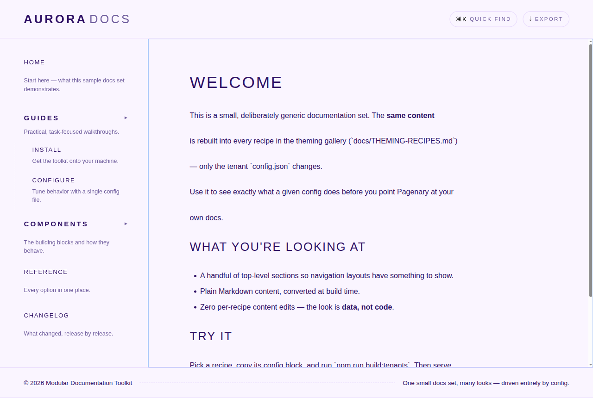
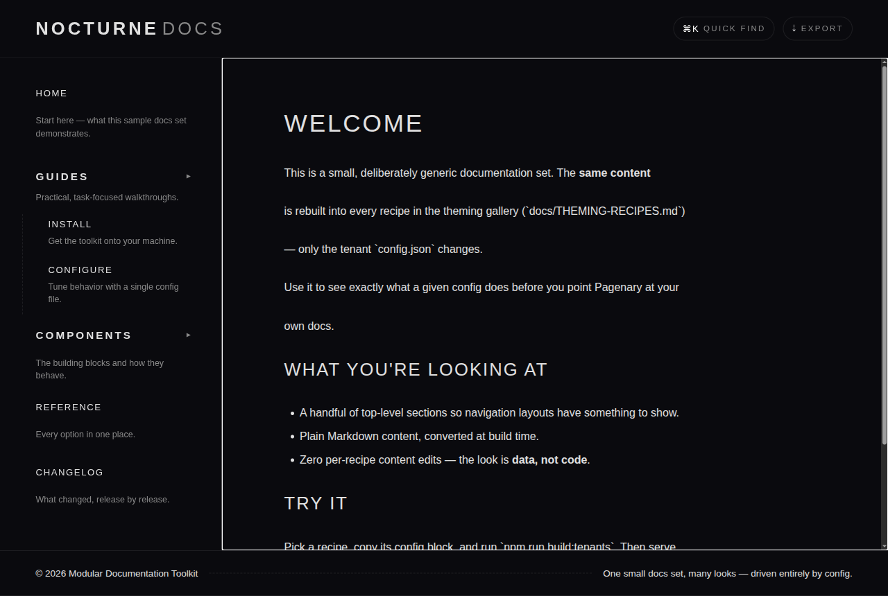
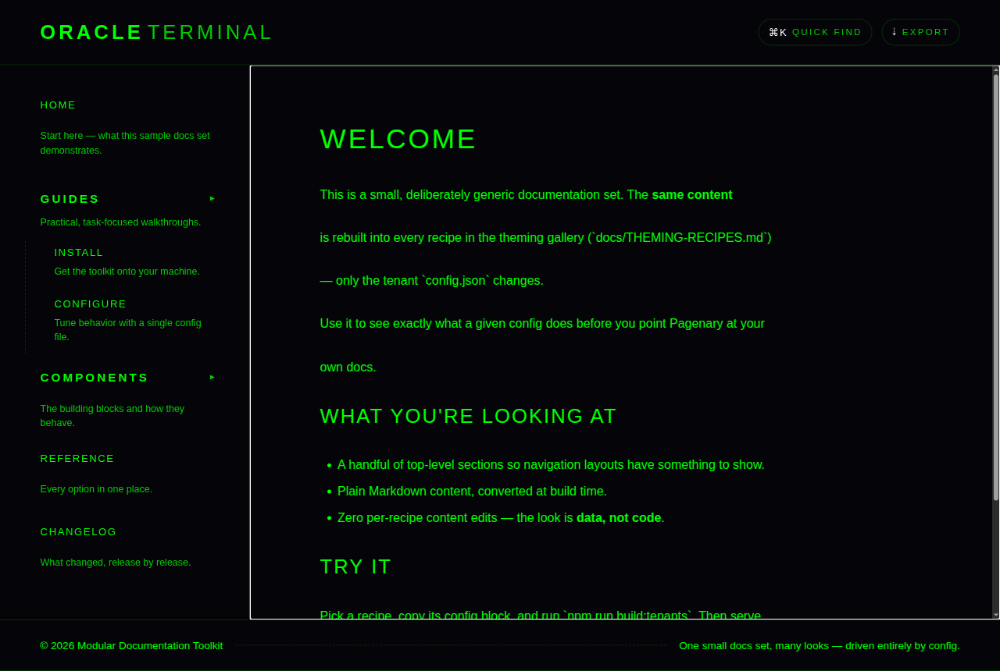
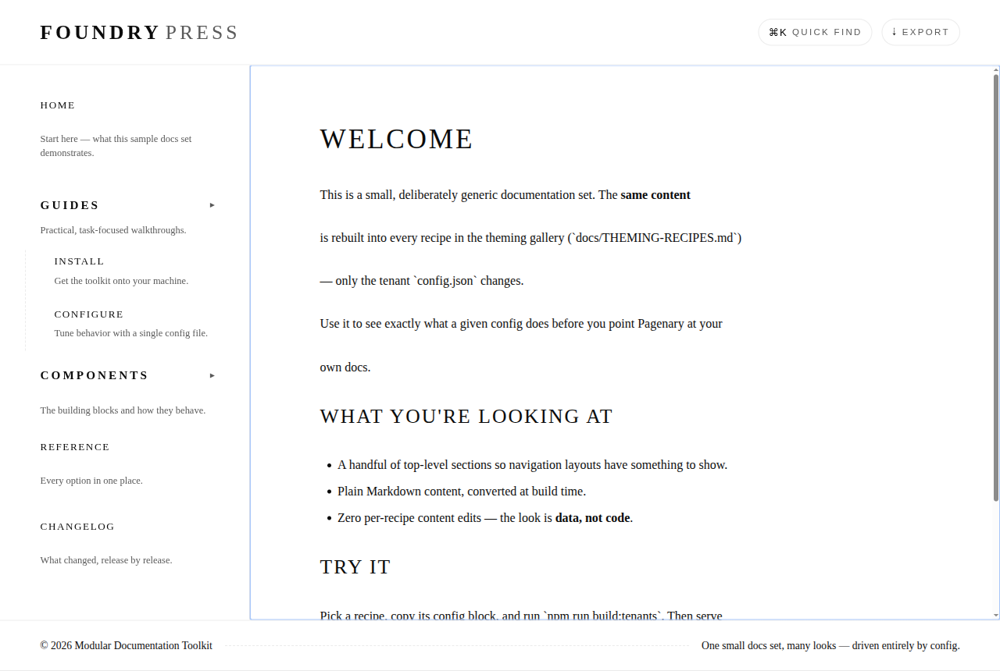
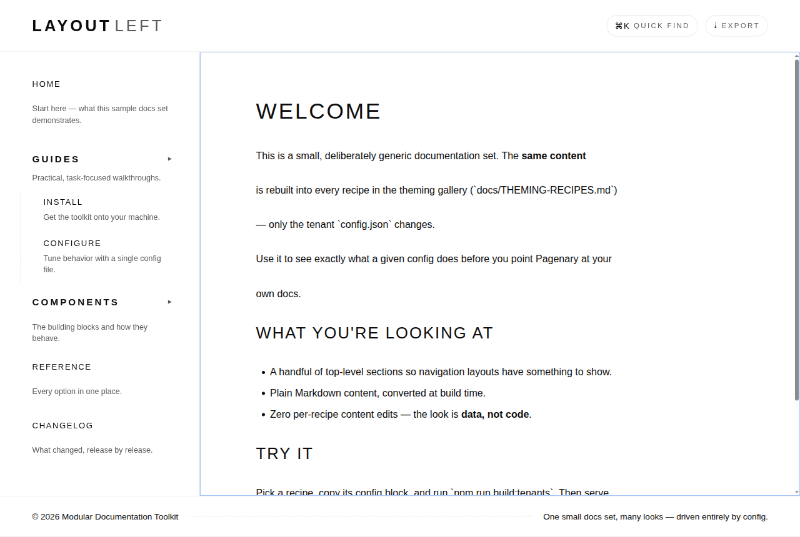
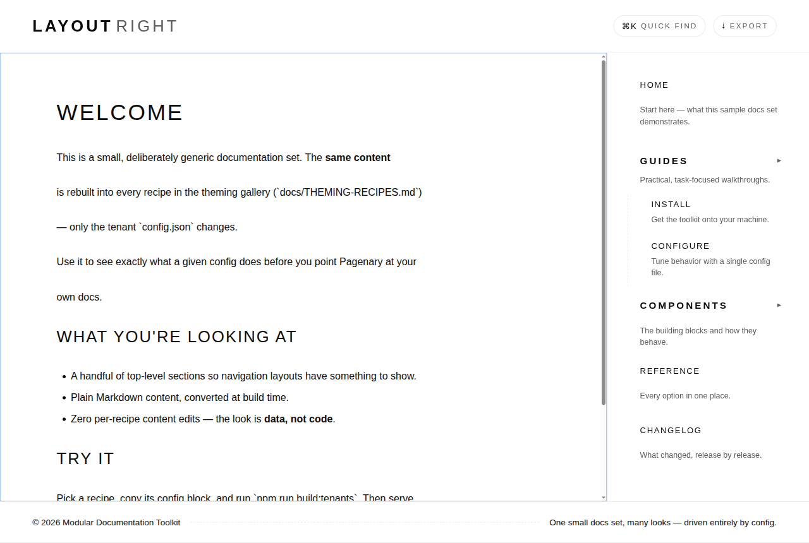
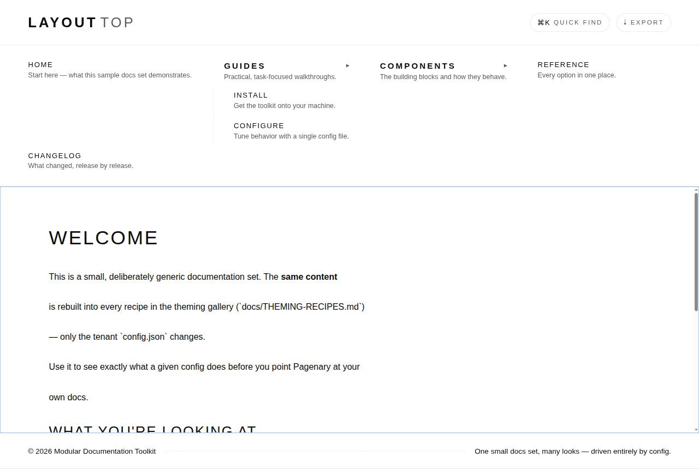
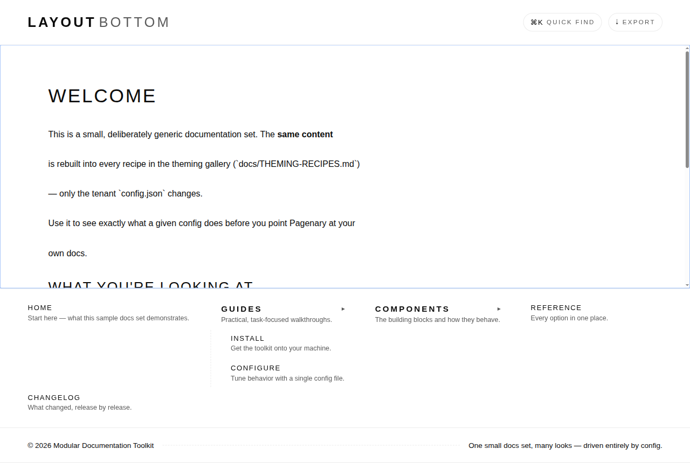
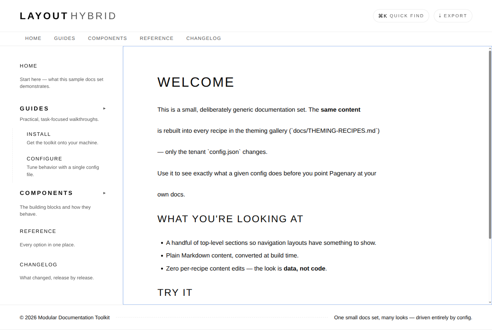
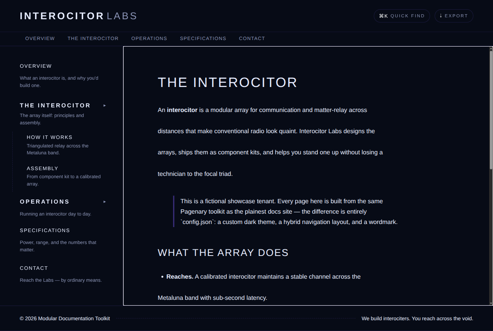

# Theming Recipes

Copy-paste starting points for the most common ways to customize a Pagenary
tenant. Every recipe below is **the same documentation set** rebuilt with a
different tenant `config.json` — the look is **data, not code**. There is no
generator fork, no CSS surgery, and no per-recipe content.

All recipes live in [`../examples/`](../examples/) and are registered in
[`../examples/recipes.tenants.json`](../examples/recipes.tenants.json). Build the
whole gallery and serve it locally:

```bash
npm run build:examples      # builds dist/<recipe-id>/ for every recipe
npm run serve:dev           # then open http://localhost:5173/<recipe-id>/
```

The screenshots below were captured from those builds. For the full list of
config keys, see [`TENANT-CONFIG.md`](TENANT-CONFIG.md).

> **Where recipes get their content.** The color/style/nav recipes share one
> small docs set in [`../examples/content-base/`](../examples/content-base/) and
> override only their branding/theme/layout via the registry's inline `config`.
> The [interocitor showcase](#fully-custom-showcase-interocitor) has its own
> richer content under [`../examples/interocitor/`](../examples/interocitor/).

---

## Colors

### Custom palette (`theme-colors`)

A light theme with a bold accent and a tinted surface — the legacy per-color
keys, no preset.



```json
{
  "brandMark": "Aurora",
  "brandSub": "Docs",
  "accentColor": "#7c3aed",
  "surfaceColor": "#faf5ff",
  "inkColor": "#2e1065",
  "mutedColor": "#6d5b9c",
  "gridLineColor": "rgba(124, 58, 237, 0.16)"
}
```

### Dark preset (`theme-dark`)

The built-in `dark` preset — one key flips the entire color scheme, including
code blocks, tables, and the command palette.



```json
{
  "brandMark": "Nocturne",
  "brandSub": "Docs",
  "theme": "dark"
}
```

### Matrix preset (`theme-matrix`)

The built-in `matrix` preset — a green-on-black terminal aesthetic.



```json
{
  "brandMark": "Oracle",
  "brandSub": "Terminal",
  "theme": "matrix"
}
```

> `theme` accepts the presets `light`, `dark`, and `matrix`, **or** a full custom
> object (`{ "colorScheme": "dark", "surface": "...", "accent": "...", ... }`).
> The interocitor showcase below uses a custom object.

---

## Basic style changes

### Fonts + brand (`basic-styles`)

Swap typography and the wordmark without touching colors. `fontBody` and
`fontMono` accept any CSS font stack.



```json
{
  "brandMark": "Foundry",
  "brandSub": "Press",
  "accentColor": "#b45309",
  "fontBody": "Georgia, 'Times New Roman', serif",
  "fontMono": "'Courier New', Courier, monospace"
}
```

---

## Navigation positions

`navPosition` controls where navigation sits. Five values are supported:

| Value | Layout |
| --- | --- |
| `left` *(default)* | Vertical sidebar on the leading edge |
| `right` | Vertical sidebar on the trailing edge |
| `top` | Horizontal bar above the content |
| `bottom` | Horizontal bar below the content |
| `hybrid` | Horizontal primary strip **and** the left rail |

### Left (`nav-left`, default)



```json
{ "navPosition": "left" }
```

### Right (`nav-right`)



```json
{ "navPosition": "right" }
```

### Top (`nav-top`)

The sidebar becomes a horizontal bar; top-level groups lay out across the top
with their children inline.



```json
{ "navPosition": "top" }
```

### Bottom (`nav-bottom`)

The same horizontal bar, anchored beneath the content.



```json
{ "navPosition": "bottom" }
```

### Hybrid (`nav-hybrid`)

A horizontal **primary strip** of top-level sections under the header, plus the
full **left rail** for deep navigation. The strip is generated at build time
from the tenant's manifest — no extra config.



```json
{ "accentColor": "#2563eb", "navPosition": "hybrid" }
```

> **How it works.** Layout rules are scoped to a `data-nav-position` attribute on
> `<body>`, set at build time from `navPosition`. `left` is the default and adds
> nothing. `hybrid` additionally injects a `<nav class="nav-strip">` after the
> header, linking each top-level section to its first page.

---

## Fully-custom showcase: Interocitor

A complete, opinionated tenant for a fictitious deep-tech company that builds
**interociters** — proof of how far the look can be pushed with config alone. It
combines a **custom dark `theme` object**, a `hybrid` nav layout, custom fonts,
and a bespoke wordmark and tagline. Same toolkit, same build, zero forks.



```json
{
  "title": "Interocitor Labs — Deep-Tech Communications",
  "brandMark": "INTEROCITOR",
  "brandSub": "Labs",
  "tagline": "We build interociters. You reach across the void.",
  "navPosition": "hybrid",
  "fontBody": "'Space Grotesk', 'IBM Plex Sans', -apple-system, sans-serif",
  "fontMono": "'IBM Plex Mono', ui-monospace, monospace",
  "theme": {
    "colorScheme": "dark",
    "surface": "#070b16",
    "ink": "#e6ecff",
    "muted": "#8a93b5",
    "accent": "#7c5cff",
    "gridLine": "rgba(124, 92, 255, 0.18)",
    "sidebarBg": "#0b1020"
  }
}
```

The full config (every theme key) is in
[`../examples/interocitor/config.json`](../examples/interocitor/config.json).

---

## Reproduce any recipe

1. Copy a config block above into a tenant's `config.json` (or an inline
   `config` in your registry).
2. Build: `npm run build:tenants` (or `npm run build:examples` for the gallery).
3. Serve and compare: `npm run serve:dev`, then open
   `http://localhost:5173/<tenant-id>/`.

Screenshots are regenerated from the live builds, so what you see here is exactly
what the config produces.
